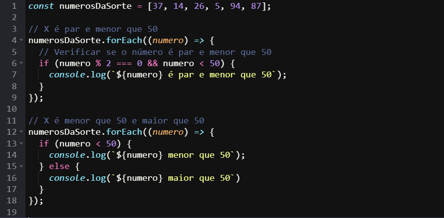
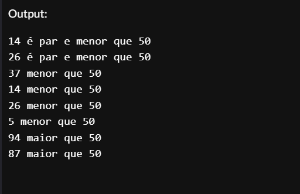

# Desenvolvimento Extra 2.3

## 📝 Descrição do projeto

Acesse o site OneCompiler (https://onecompiler.com/javascript/), copie e cole o array 'numerosDaSorte', e logo em seguida escreva o código necessário para avaliar cada elemento do array e imprimir uma frase seguindo algum dos seguintes três modelos:

- X é par e menor que 50
- X é menor que 50
- X é maior que 50

numerosDaSorte = [37, 14, 26, 5, 94, 87]

## 1️⃣2️⃣ Resolução

O primeiro código verifica se o número é par e menor que 50 e o segundo verifica os números que são < 50 e, por fim, tem a condição que identifica os números que são maiores que 50.

**Output**

