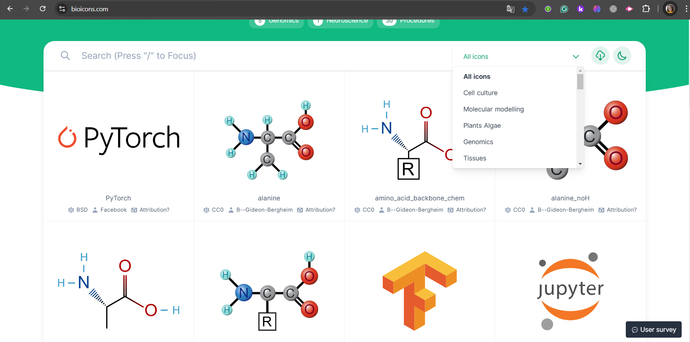

## Desenvolvimento 1 
### Instruções do projeto
Tira um print de alguma seção de uma página web na qual você tenha identificado o possível uso do JavaScript para implementar uma funcionalidade através da interação do usuário (em outras palavras, algo que não daria para fazer apenas com HTML e CSS).

Sem a necessidade de inspecionar o elemento web, descreva da forma mais detalhada possível o comportamento que leva você a acreditar que seria necessário o uso de JS.

## Resolução

A imagem do site bioicons destaca o filtro de pesquisa utilizado, que provavelmente faz uso do JavaScript, proporcionando uma funcionalidade de pesquisa interativa, permitindo que os usuários filtrem os ícones com base nos seguintes parâmetros: all icons, cell culture, molecular modelling, entre outros.

