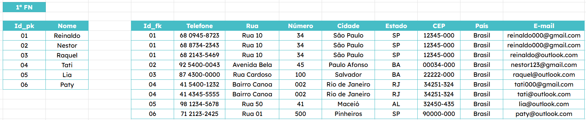

# Desenvolvimento 3

## 📝 Descrição do projeto

A normalização de dados é um processo realizado nas tabelas para evitar anomalias. Com base no conteúdo visto no Hipertexto 3, transforme a tabela em anexo na Primeira Forma Normal (1FN).

## Resolução

